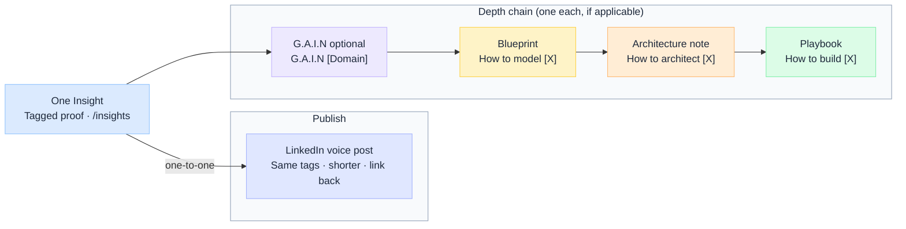

# Content Bank

Master list for [jitendersharma.dev](https://jitendersharma.dev). Schedule cadence in the [12 Weeks Plan](./Weeks-Plan).

:::tip[Tagging]
**Insight:** one Core pillar · one voice slug · one or more topic slugs → [Tagging Guidelines](./tagging-guide/Tagging-Guidelines-for-Insights) · [Core Pillars](./tagging-guide/core-pillars) · [Voice Tags](./tagging-guide/voice-tags) · [Topic Tags](./tagging-guide/topic-tags).

**G.A.I.N · Blueprint · Architecture · Playbook:** same Core pillar and topic slugs as the parent stack (no voice tag).
:::

### How each Insight stacks

Every Insight gets, where applicable, **one G.A.I.N · one Blueprint · one Architecture note · one Playbook**. Names stay consistent: **How to model** (Blueprint) · **How to architect** (Architecture) · **How to build** (Playbook).

---

## Master content bank

**One row per Insight** · each with its own depth chain. `—` = not applicable. Related Insights may point to the same shared asset (e.g. the RAG pipeline pieces share the RAG blueprint).

| Insight | Pillar | Voice | Topics | Tier | G.A.I.N | Blueprint · *how to model* | Architecture · *how to architect* | Playbook · *how to build* |
| --- | --- | --- | --- | --- | --- | --- | --- | --- |
| [How LLM Works Under the Hood](https://jitendersharma.dev/insights/how-llm-work-under-the-hood) | Strategy & Architecture | `exp` | `llm` | Single | [G.A.I.N LLM](https://jitendersharma.dev/frameworks/gain-llm) | How to model the LLM inference path | [How to architect LLM production patterns](https://jitendersharma.dev/architecture) | [How to integrate LLMs in production](https://jitendersharma.dev/playbooks/llm-integration-guide) |
| [Hallucinations Is a System Design Problem](https://jitendersharma.dev/insights/hallucinations-is-a-system-design-problem-not-model-problem) | AI & Intelligence | `pov` | `llm` · `hallucinations` | Single | [G.A.I.N Prompt](https://jitendersharma.dev/frameworks/gain-prompt) | How to model a grounding and verification pipeline | How to architect hallucination guardrails | How to build a verification layer |
| [AI Observability in Enterprise](https://jitendersharma.dev/insights/ai-observability-in-enterprise) | Platforms & Engineering | `exp` | `observability` | Single | [G.A.I.N Observability](https://jitendersharma.dev/frameworks/gain-observability) | How to model AI telemetry capture | How to architect AI observability | [How to observe AI in production](https://jitendersharma.dev/playbooks/ai-observability) |
| [Policy-Governed Agent Runtime](https://jitendersharma.dev/insights/policy-governed-agent-runtime) | Governance & Trust | `arch` | `agents` · `policy` · `compliance` | Single | [G.A.I.N Agents](https://jitendersharma.dev/frameworks/gain-agents) | [How to model agent execution flows](https://jitendersharma.dev/blueprints/agent-flow-model) | How to architect governed agent systems | [How to design agentic systems](https://jitendersharma.dev/playbooks/agentic-systems-design) |
| A production RAG pipeline, layer by layer | AI & Intelligence | `arch` | `rag` | Single | [G.A.I.N RAG](https://jitendersharma.dev/frameworks/gain-rag) | [How to model RAG pipeline layers](https://jitendersharma.dev/blueprints/rag-architecture) | How to architect enterprise RAG systems | [How to build enterprise RAG](https://jitendersharma.dev/playbooks/build-enterprise-rag) |
| RAG is Not a Database | AI & Intelligence | `pov` | `rag` | Single | [G.A.I.N RAG](https://jitendersharma.dev/frameworks/gain-rag) | [How to model RAG pipeline layers](https://jitendersharma.dev/blueprints/rag-architecture) | How to architect enterprise RAG systems | [How to build enterprise RAG](https://jitendersharma.dev/playbooks/build-enterprise-rag) |
| Access control in RAG: the question nobody asks until the audit | Governance & Trust | `exp` | `rag` · `identity` · `policy` · `compliance` | Single | [G.A.I.N Identity](https://jitendersharma.dev/frameworks/gain-identity) | How to model RAG access control | How to architect policy and identity boundaries | How to build access-controlled RAG |
| After studying several agent frameworks — what they get wrong for enterprise | AI & Intelligence | `lrn` | `agents` | Single | [G.A.I.N Agents](https://jitendersharma.dev/frameworks/gain-agents) | [How to model agent execution flows](https://jitendersharma.dev/blueprints/agent-flow-model) | How to architect governed agent systems | [How to design agentic systems](https://jitendersharma.dev/playbooks/agentic-systems-design) |
| Applying the decision model to a banking assistant — a worked example | AI & Intelligence | `pov` | `agents` · `policy` | Single | [G.A.I.N Agents](https://jitendersharma.dev/frameworks/gain-agents) | [How to model the decision](https://jitendersharma.dev/blueprints/decision-model) | How to architect a banking AI assistant | [How to design agentic systems](https://jitendersharma.dev/playbooks/agentic-systems-design) |
| Human-in-the-loop is an architecture decision, not a feature | AI & Intelligence | `pov` | `agents` · `policy` | Single | [G.A.I.N Agents](https://jitendersharma.dev/frameworks/gain-agents) | How to model human-in-the-loop checkpoints | How to architect governed agent systems | [How to design agentic systems](https://jitendersharma.dev/playbooks/agentic-systems-design) |
| How I would design an AI assistant for customer service | AI & Intelligence | `arch` | `agents` · `memory` | Single | [G.A.I.N Agents](https://jitendersharma.dev/frameworks/gain-agents) | [How to model agent memory](https://jitendersharma.dev/blueprints/memory-model) | How to architect a customer-service assistant | [How to design agentic systems](https://jitendersharma.dev/playbooks/agentic-systems-design) |
| Decision Model: when to use RAG vs Fine-tuning vs Agents vs MCP | Strategy & Architecture | `arch` | `rag` · `agents` · `mcp` · `fine-tuning` | Anchor 🚩 | [G.A.I.N core](https://jitendersharma.dev/frameworks) | [How to model the decision](https://jitendersharma.dev/blueprints/decision-model) | How to architect mixed RAG / FT / agent systems | — |
| Reference Architecture: LLM + RAG + orchestration + governance in banking | Strategy & Architecture | `arch` | `llm` · `rag` · `agents` · `policy` · `orchestration` | Anchor 🚩 | [G.A.I.N core](https://jitendersharma.dev/frameworks) | [How to model the full enterprise AI stack](https://jitendersharma.dev/blueprints/gain-architecture) | How to architect full-stack AI foundations | How to build a banking AI platform |
| The AI Architecture Maturity Model — 5 levels | Strategy & Architecture | `exp` | `evaluation` | Anchor 🚩 | — | How to model AI architecture maturity | How to architect for the next maturity level | — |
| MCP explained for enterprise architects (no hype) | AI & Intelligence | `exp` | `mcp` | Single | [G.A.I.N MCP](https://jitendersharma.dev/frameworks/gain-mcp) | How to model an MCP tool registry | How to architect governed MCP integration | — |
| A governed MCP setup: auth, versioning, and tool registries | AI & Intelligence | `arch` | `mcp` · `policy` | Single | [G.A.I.N MCP](https://jitendersharma.dev/frameworks/gain-mcp) | How to model an MCP tool registry | How to architect governed MCP integration | How to build a governed MCP setup |
| Why most LLM architectures fail in production | Platforms & Engineering | `exp` | `llm` | Single | [G.A.I.N LLM](https://jitendersharma.dev/frameworks/gain-llm) | How to model an LLM gateway | [How to architect LLM production patterns](https://jitendersharma.dev/architecture) | [How to integrate LLMs in production](https://jitendersharma.dev/playbooks/llm-integration-guide) |
| What an LLM actually costs at 1M requests/day — a real breakdown | Platforms & Engineering | `exp` | `llm` · `cost` | Single | — | How to model LLM cost at scale | How to architect for LLM cost and routing | [How to build data pipelines for AI](https://jitendersharma.dev/playbooks/data-pipelines-for-ai) |
| Production readiness for AI: the checklist most teams skip | Platforms & Engineering | `pov` | `observability` · `compliance` | Single | [G.A.I.N Observability](https://jitendersharma.dev/frameworks/gain-observability) | How to model an AI readiness gate | How to architect AI observability | [How to observe AI in production](https://jitendersharma.dev/playbooks/ai-observability) |
| The agent observability gap enterprises are sleepwalking into | Platforms & Engineering | `pov` | `observability` · `agents` | Single | [G.A.I.N Observability](https://jitendersharma.dev/frameworks/gain-observability) | How to model agent observability | How to architect AI observability | [How to observe AI in production](https://jitendersharma.dev/playbooks/ai-observability) |
| After reviewing multiple RAG implementations, 3 patterns are emerging | AI & Intelligence | `lrn` | `rag` · `evaluation` | Single | [G.A.I.N Evaluation](https://jitendersharma.dev/frameworks/gain-evaluation) | How to model a RAG eval harness | How to architect RAG evaluation | How to build a RAG eval harness |
| Patterns from enterprise AI rollouts that succeeded vs stalled | Strategy & Architecture | `lrn` | `evaluation` | Single | [G.A.I.N Evaluation](https://jitendersharma.dev/frameworks/gain-evaluation) | How to model an AI rollout scorecard | — | — |
| Governance for AI isn't a doc — it's an architecture | Governance & Trust | `pov` | `policy` · `identity` | Single | [G.A.I.N Identity](https://jitendersharma.dev/frameworks/gain-identity) | How to model a policy enforcement layer | How to architect policy and identity boundaries | — |
| Integrating AI with 20-year-old core systems: a survival guide | Platforms & Engineering | `exp` | `integration` · `data` | Single | — | How to model legacy AI integration | [How to architect distributed systems](https://jitendersharma.dev/architecture/distributed-systems) | [How to build data pipelines for AI](https://jitendersharma.dev/playbooks/data-pipelines-for-ai) |
| Azure OpenAI vs Bedrock: the decision is rarely about the model | Platforms & Engineering | `pov` | `llm` | Single | — | How to model a cloud LLM choice | — | — |
| 90 days of publishing on enterprise AI — what I learned | Strategy & Architecture | `pov` | `evaluation` | Single | — | — | — | — |
| Fine-tuning is overused — most teams need RAG + better prompts | AI & Intelligence | `pov` | `rag` · `llm` · `fine-tuning` · `prompt` | Single | [G.A.I.N RAG](https://jitendersharma.dev/frameworks/gain-rag) | [How to model the decision](https://jitendersharma.dev/blueprints/decision-model) | — | — |
| Re-ranking is the cheapest quality win most teams skip | AI & Intelligence | `pov` | `rag` | Single | [G.A.I.N RAG](https://jitendersharma.dev/frameworks/gain-rag) | [How to model RAG pipeline layers](https://jitendersharma.dev/blueprints/rag-architecture) | — | — |
| Context windows are a trap | AI & Intelligence | `exp` | `llm` · `prompt` | Single | [G.A.I.N LLM](https://jitendersharma.dev/frameworks/gain-llm) | How to model context budgeting | — | — |
| Why autonomous agents scare auditors | Governance & Trust | `exp` | `agents` · `compliance` | Single | [G.A.I.N Agents](https://jitendersharma.dev/frameworks/gain-agents) | How to model an agent audit trail | How to architect governed agent systems | — |
| Workflows vs autonomy: where I draw the line for enterprise agents | AI & Intelligence | `pov` | `agents` | Single | [G.A.I.N Agents](https://jitendersharma.dev/frameworks/gain-agents) | [How to model agent execution flows](https://jitendersharma.dev/blueprints/agent-flow-model) | — | — |
| Most "agents" in production are just workflows | AI & Intelligence | `pov` | `agents` | Single | [G.A.I.N Agents](https://jitendersharma.dev/frameworks/gain-agents) | [How to model agent execution flows](https://jitendersharma.dev/blueprints/agent-flow-model) | — | — |
| MCP vs traditional microservices orchestration | AI & Intelligence | `pov` | `mcp` · `orchestration` | Single | [G.A.I.N MCP](https://jitendersharma.dev/frameworks/gain-mcp) | How to model an MCP tool registry | — | — |
| Where guardrails actually live in an enterprise AI stack | Governance & Trust | `arch` | `policy` · `agents` · `identity` | Single | [G.A.I.N Identity](https://jitendersharma.dev/frameworks/gain-identity) | How to model a policy enforcement layer | How to architect policy and identity boundaries | — |
| LLMs should never enforce policy | Governance & Trust | `pov` | `policy` · `identity` | Single | [G.A.I.N Identity](https://jitendersharma.dev/frameworks/gain-identity) | How to model a policy enforcement layer | — | — |
| Compliance patterns for production AI | Governance & Trust | `arch` | `policy` · `compliance` · `identity` | Single | [G.A.I.N Identity](https://jitendersharma.dev/frameworks/gain-identity) | How to model a compliance control map | How to architect policy and identity boundaries | — |
| Designing an LLM gateway for cost, routing, and governance | Platforms & Engineering | `arch` | `llm` · `policy` · `cost` | Single | [G.A.I.N LLM](https://jitendersharma.dev/frameworks/gain-llm) | How to model an LLM gateway | [How to architect LLM production patterns](https://jitendersharma.dev/architecture) | [How to integrate LLMs in production](https://jitendersharma.dev/playbooks/llm-integration-guide) |
| Event-driven AI: systems that react, not just respond | Platforms & Engineering | `exp` | `integration` | Single | — | How to model event-driven AI | [How to architect distributed systems](https://jitendersharma.dev/architecture/distributed-systems) | — |
| Token economics 101 for engineering leaders | Platforms & Engineering | `exp` | `llm` · `cost` | Single | — | How to model LLM cost at scale | — | — |
| Latency is a feature: architecting for it in LLM apps | Platforms & Engineering | `exp` | `llm` · `cost` | Single | — | How to model an LLM latency budget | [How to architect LLM production patterns](https://jitendersharma.dev/architecture) | — |
| Domain boundaries in AI-enabled systems | Strategy & Architecture | `pov` | `orchestration` | Single | — | How to model AI domain boundaries | — | — |
| Why transformation roadmaps fail without architecture authority | Strategy & Architecture | `lrn` | `orchestration` | Single | — | — | — | — |

**Legend**

| Column | Meaning |
| --- | --- |
| **Pillar · Voice · Topics** | One Core pillar · one voice slug (`pov` · `lrn` · `arch` · `exp`) · one or more topic slugs → [Tagging Guidelines](./tagging-guide/Tagging-Guidelines-for-Insights) |
| **Tier** | Single-tension (default) · Anchor 🚩 |
| **G.A.I.N / Blueprint / Architecture / Playbook** | One depth asset each · `—` = not applicable |

**Naming style:** Blueprint = **How to model [X]** · Architecture = **How to architect [X]** · Playbook = **How to build [X]** · G.A.I.N = **G.A.I.N [Domain]**.

**Engines:** [Insight](../insight/Overview) · [G.A.I.N](../gain/Overview) · [Blueprint](../blueprint/Overview) · [Architecture](../architecture/Overview) · [Playbook](../playbook/Overview)

---

## Cross-links

| I want to… | Go to |
| --- | --- |
| Tag any asset | [Tagging Guidelines](./tagging-guide/Tagging-Guidelines-for-Insights) · [Core Pillars](./tagging-guide/core-pillars) · [Voice Tags](./tagging-guide/voice-tags) · [Topic Tags](./tagging-guide/topic-tags) |
| Schedule cadence | [12 Weeks Plan](./Weeks-Plan) |
| Add a new Insight row | [Insight Engine → template](../insight/Overview#new-insight-template) |
