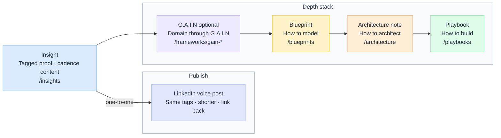

# Content Engine

The Content Engine is your **strategic asset library** — every topic you might write about over the next 12–24 months.

:::tip[How this connects]
**Content Bank** (2 Insights/week + assets) → **12 Weeks Plan** → **Insight Engine** (publish Insights) · **Post Engine** (one LinkedIn post per Insight)
:::

**Insights** → one Core pillar · one primary voice slug · one or more topic slugs · **[Tagging Guidelines](./tagging-guide/Tagging-Guidelines-for-Insights)**.

**G.A.I.N · Blueprint · Architecture · Playbook** → one Core pillar · one or more topic slugs (no voice) · **[Content Bank](./Content-Bank)** · rules → **[Tagging Guidelines](./tagging-guide/Tagging-Guidelines-for-Insights)**

---

## What goes where

Five content types on [jitendersharma.dev](https://jitendersharma.dev). Each has a different job — do not mix channels (e.g. a Signature Article is **not** an Insight).

| Asset | Route | What goes in it | Tagging | When to ship |
| --- | --- | --- | --- | --- |
| **Insight** | `/insights` | Proof — one argument per piece. **Default single-tension** (~1000–1500 words, route depth down); **anchor** flagship on IP weeks. `pov` · `lrn` · `arch` · `exp`. | **Yes** — Core pillar · voice slug · topic slug(s) → [Tagging Guidelines](./tagging-guide/Tagging-Guidelines-for-Insights) | **2/week** (Tue + Thu) · [Content Bank](./Content-Bank#master-content-bank) |
| **G.A.I.N** | `/frameworks` | **Core framework** — Governed AI-Native Systems operating model (G · A · I · N loop). **Signature Articles** — standalone domain pieces (LLM · RAG · Agents · MCP · Prompt · Evaluation · Observability · Identity) each explaining the topic **through G.A.I.N**. | **Yes** — Core pillar · topic slug(s) (no voice) → [Tagging Guidelines](./tagging-guide/Tagging-Guidelines-for-Insights) | One Signature Article at a time · [G.A.I.N catalog](../gain/Types#gain-signature-articles) |
| **Blueprint** | `/blueprints` | **How to model** — visual reference (decision trees, layer diagrams, flows) | **Yes** — Core pillar · topic slug(s) (no voice) | After G.A.I.N or anchor Insight · [Blueprints](../blueprint/Types) |
| **Architecture** | `/architecture` | **How to architect** — durable systems notes, flows, contracts | **Yes** — Core pillar · topic slug(s) (no voice) | After blueprint for the same topic · [Architecture Engine](../architecture/Overview) |
| **Playbook** | `/playbooks` | **How to build** — step-by-step implementation | **Yes** — Core pillar · topic slug(s) (no voice) | Last in stack · [Content Bank](./Content-Bank#master-content-bank) |

### How they stack

:::info[G.A.I.N is optional]
Not every topic needs a Signature Article. When there is no G.A.I.N piece, route **Insight depth** straight to **Blueprint**.
:::

**One-pane view:** [Content Bank → Master content bank](./Content-Bank#master-content-bank)

**Rules of thumb**

- **Insight** = one tension, route depth down — single-tension by default; anchor on IP weeks.
- **G.A.I.N** = optional — domain reference through the framework; not every topic needs one.
- **Blueprint** = how to model — one-page visual the advisor cites.
- **Architecture** = how to architect — systems depth Insights do not repeat.
- **Playbook** = how to build — ship last; link back up the stack.

**Depth-first rule:** an Insight only links down once its sibling in the stack is live or drafted the same cycle.

Core framework at [/frameworks](https://jitendersharma.dev/frameworks) is the **spine** — every Insight, Signature Article, blueprint, and playbook links back to G.A.I.N.

---

## Pages in this section

- **[Tagging guide](./tagging-guide/Tagging-Guidelines-for-Insights)** — asset-type tagging rules and workflows
- **[Core Pillars](./tagging-guide/core-pillars)** — four domain slugs
- **[Topic Tags](./tagging-guide/topic-tags)** — seventeen cross-cutting topic slugs
- **[Voice Tags](./tagging-guide/voice-tags)** — four primary voices (Insights only)
- **[Content Bank](./Content-Bank)** — [Master content bank](./Content-Bank#master-content-bank)
- **[G.A.I.N](../gain/Types)** — pillars · Signature Article catalog · build track → Gain Engine
- **[Template](../gain/Template)** · **[Example](../gain/Example)** — planning template · worked example · publish checklist
- **[Blueprints](../blueprint/Types)** — reference models and IP launch sequence → Blueprint Engine
- **[Architecture Engine](../architecture/Overview)** — platform and systems notes → `/architecture`
- **[Playbook Engine](../playbook/Overview)** — step-by-step guides → `/playbooks`
- **[12 Weeks Plan](./Weeks-Plan)** — three-phase schedule
