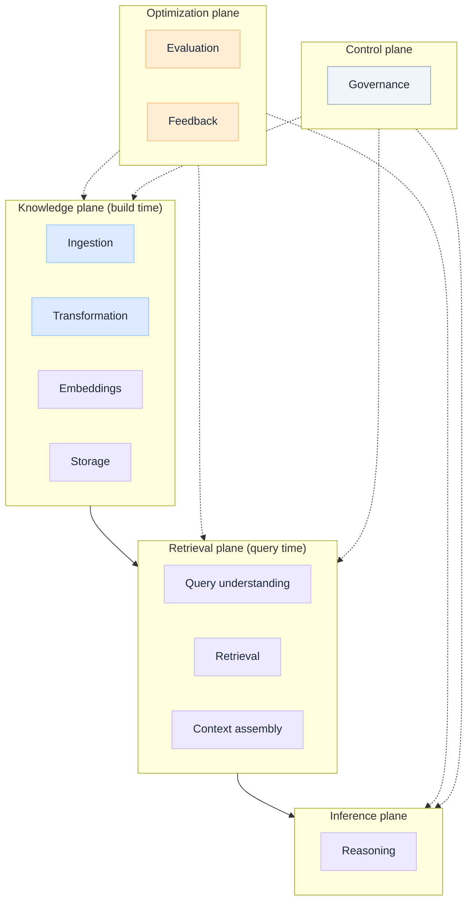
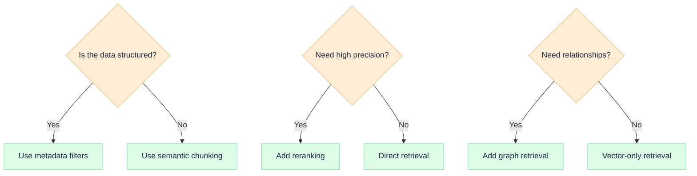
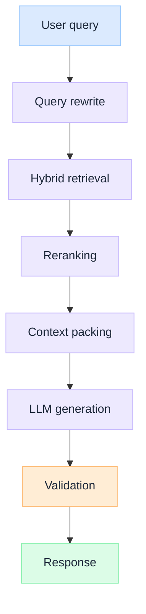

# How to model RAG pipeline layers: a systems view

Production RAG is a layered distributed system, not a vector store with a prompt attached. Model it as five planes: a build-time **Knowledge** plane, a query-time **Retrieval** plane, an **Inference** plane that reasons, an **Optimization** plane that learns, and a **Control** plane that governs. Use this page in a design review to place responsibilities, trace the runtime path, and choose the architecture for your precision, latency, and trust constraints.

## 1. Why RAG needs layered architecture

The fastest demo in AI is "retrieve top-k chunks, paste into a prompt, return the answer." It also fails first in production, because that single step quietly carries five different responsibilities and degrades on all of them at once.

At scale the cracks are predictable:

- **Freshness.** A one-off ingest script goes stale the moment a source changes. Without a build-time pipeline, the corpus drifts from reality and no one can say when.
- **Trust.** Retrieval with no identity boundary leaks across tenants. Generation with no abstention path turns thin evidence into fluent, confident wrong answers.
- **Latency.** Recall, reranking, and multi-hop reasoning each add milliseconds. Collapsed into one step, you cannot tune the budget where it matters.
- **Cost.** Embedding the whole corpus on every change, or packing oversized context on every call, burns money that layering lets you control.

Layering is the response. Each plane owns one responsibility, fails in an isolated and observable way, and emits a signal you can evaluate and audit. The motivation is not elegance. It is the ability to scale a knowledge system without losing freshness, trust, latency, or cost control.

## 2. How to model it (visual first)

Anchor the mental model with three views: the **layer diagram** (what exists), the **decision trees** (what to choose), and the **flow diagram** (what runs).

### Layer diagram: the full stack

Read it top to bottom for the request path (knowledge feeds retrieval feeds inference), and read the dotted edges as cross-cutting: optimization and control attach to every plane, they are not a final step.

### Decision trees: choosing the path

The planes are fixed. The components inside them are choices. Three decisions cover most of the architecture:

Each branch is an architecture commitment, not a tuning knob. Structure decides how you chunk and filter, precision decides whether you pay for reranking, and relationship needs decide whether vectors alone are enough.

### Flow diagram: runtime execution

The layer diagram shows structure. This shows what happens on a single request.

The flow crosses three planes: rewrite through packing live in retrieval, generation in inference, and validation is the control-plane gate that decides whether the response ships or the system abstains.

## 3. Mental model: RAG as a distributed knowledge system

Stop thinking "vector database." Think four cooperating subsystems behind one request:

- **Knowledge system.** Curates, transforms, and stores what the organization knows. Build-time, asynchronous, versioned.
- **Retrieval engine.** Finds the right evidence for one query, scoped to one principal. Query-time, latency-bound.
- **Reasoning engine.** Synthesizes an answer from a bounded context pack. Stateless per call, fluency without grounding is the risk.
- **Feedback system.** Observes outcomes and feeds quality back into the other three. Continuous, the only reason the system improves.

The core idea: **RAG is a layered distributed system.** Every property you expect from distributed systems applies here too: independent failure domains, observability per layer, versioning for rollback, and trust boundaries enforced in code, not in hope.

## 4. Knowledge plane

The build-time pipeline. This plane decides how knowledge becomes searchable, and its failures are invisible until query time.

| Stage | Owns | Skipping it causes |
| --- | --- | --- |
| **Ingestion** | Source connectors, parsing, dedupe, source versioning | Stale corpus, lost provenance, no freshness SLA |
| **Transformation** | Chunking strategy, metadata extraction, normalization | Garbage chunks, no filter keys, broken structure |
| **Representation** | Embedding model choice, embedding versioning | No rollback on a bad re-embed, silent drift |
| **Storage** | Vector index, lexical index, hybrid layout | No hybrid recall, no versioned rollback primitive |

**Focus: how knowledge is built.** Treat the index as versioned infrastructure. Every re-embed is a deploy that must be eval-gated and reversible.

## 5. Retrieval plane

Query-time evidence assembly. This plane turns a question and an identity into a bounded, ranked context pack.

| Stage | Owns | Skipping it causes |
| --- | --- | --- |
| **Query understanding** | Rewrite, expansion, intent and entity extraction | Literal matching, missed evidence, poor recall |
| **Search orchestration** | Hybrid (lexical + vector) search, ACL filter, top-k | Cross-tenant leakage, low precision candidates |
| **Reranking** | Cross-encoder scoring, score thresholds | Top-k blobs instead of the actually relevant set |
| **Context construction** | Token budget, dedupe, ordering, attribution | Bloated cost, lost citations, truncated evidence |

**Focus: how evidence is found.** Identity is enforced here, before ranking spends compute, and never patched in after generation.

## 6. Inference plane

Reasoning over retrieved context. This plane synthesizes the answer and is where fluency must be held to evidence.

| Stage | Owns | Skipping it causes |
| --- | --- | --- |
| **Prompt orchestration** | System prompt, context injection, versioned templates | Unreproducible behavior, prompt drift |
| **Tool calls** | Function calling, retrieval-augmented actions | Static answers where the task needs live data or action |
| **Multi-hop reasoning** | Iterative retrieve-reason loops, planning | Shallow answers on questions that need decomposition |
| **Structured outputs** | Schema-constrained generation, citation binding | Free text that downstream systems cannot consume |

**Focus: how answers are synthesized.** Citation and abstention are outcomes the system enforces, not behaviors you wish into a prompt.

## 7. Optimization plane

Continuous improvement. This plane is why a deployed system gets better instead of decaying.

| Stage | Owns | Skipping it causes |
| --- | --- | --- |
| **Evaluation** | Offline and online quality metrics, eval gates | No definition of "good," regressions ship silently |
| **Feedback loops** | Implicit and explicit signal capture, labeling | No data to improve retrieval or ranking |
| **Failure analysis** | Error clustering, root-cause by layer | Symptoms patched at the prompt, never the cause |
| **Adaptive tuning** | Reranker, chunking, and prompt iteration | Frozen quality while the corpus and queries move |

**Focus: how quality improves.** Wire evaluation in from day one. A layer you cannot measure is a layer you cannot improve.

## 8. Control plane

Operational governance. This plane is what makes the system safe to run in a regulated enterprise.

| Stage | Owns | Skipping it causes |
| --- | --- | --- |
| **Security** | Encryption, secret handling, tenant isolation | Data exposure, failed security review |
| **Access control** | Per-principal ACLs enforced at retrieval | Cross-tenant leakage, unprovable scoping |
| **Auditability** | Replayable logs of who retrieved what under which policy | No incident archaeology, failed audit |
| **Policy enforcement** | Freshness rules, content and usage policy | Stale or non-compliant answers shipped |
| **Guardrails** | Input and output validation, abstention routing | Free generation on thin or unsafe evidence |

**Focus: enterprise readiness.** Governance attaches at three boundaries (storage, retrieval, output), not only at the model call. If you cannot replay a request under its policy, you do not have production RAG.

## 9. Design trade-offs

Layering does not remove the hard choices. It locates them. These are the decisions that turn the model into a concrete architecture.

| Trade-off | Choice | Default in regulated environments |
| --- | --- | --- |
| **Chunk size** | Small (precision) vs large (context) | Structure-aware chunks over fixed token windows |
| **Embedding cost** | Re-embed everything vs incremental | Versioned, incremental re-embed with eval gate |
| **Recall vs latency** | Wider candidate set vs faster response | Hybrid recall, then rerank inside the latency budget |
| **Hybrid vs graph** | Vector + lexical vs relationship traversal | Hybrid by default, graph only when relationships are core |
| **Static vs dynamic retrieval** | One pass vs iterative multi-hop | Single pass, escalate to multi-hop on low confidence |

Each row is a boundary you set deliberately, then evaluate. The plane model tells you where the decision lives. The trade-off table tells you which way to lean when truth, cost, and latency pull against each other.

## Related assets

| Asset | What it covers |
| --- | --- |
| [RAG is not a database](https://jitendersharma.dev/insights/rag-is-not-a-database) | Insight: RAG as runtime context construction, not storage |
| [G.A.I.N RAG](https://jitendersharma.dev/frameworks/gain-rag) | RAG through the G.A.I.N operating model |
| [How to build enterprise RAG](https://jitendersharma.dev/playbooks/build-enterprise-rag) | Playbook: step-by-step implementation |
