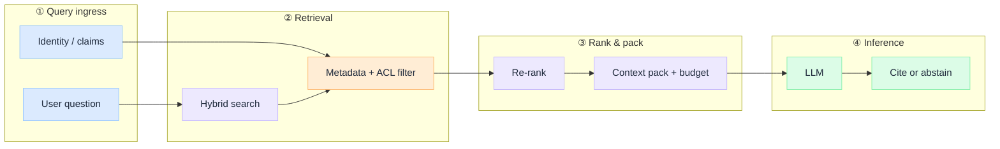

# RAG Is Not a Database

Teams ask which vector database to buy before they have defined what "retrieval" means in their system. That question assumes RAG is a data layer: ingest documents, embed them, query at runtime, paste chunks into a prompt. Storage solved, problem solved.

It is not. A vector index is one component in a **context construction pipeline** that runs on every user request. Identity, freshness, ranking, abstention, and attribution all decide whether the model answers from evidence or invents from fluency. The database does not do that work. The architecture around it does.

This is an **architecture breakdown** of what RAG actually is in production.

:::tip[THE CLAIM]
**RAG is not a database. It is runtime context construction:** a governed pipeline that assembles the right evidence, for the right principal, at query time, before inference begins.

Treating RAG as storage leads teams to optimize embedding models and chunk sizes while skipping the layers that determine truth: who may see which documents, which chunks survive ranking, and what happens when retrieval returns nothing worth citing.
:::

<!-- truncate -->

## Why the database mental model fails

The database framing is seductive because it maps to familiar CRUD workflows. Ingest PDFs. Chunk. Embed. Store. Query. Ship.

Production RAG does not look like that. At query time the system must:

1. **Scope retrieval to identity** (not every user sees every chunk)
2. **Retrieve candidates** (often hybrid: lexical + vector + metadata filters)
3. **Rank and filter** (relevance is not cosine similarity alone)
4. **Pack context** (budget tokens, dedupe, attribute sources)
5. **Decide whether to answer** (abstain when evidence is thin)

None of those steps live inside the vector store. The store holds vectors and metadata. The **pipeline** owns truth boundaries.

| Database mental model | RAG as context construction |
| --- | --- |
| **Primary job** | Persist and return stored records | Assemble governed evidence for one inference call |
| **Success metric** | Query latency, index size | Grounded answer with attributable sources |
| **Identity** | Often ignored until audit | Scoped retrieval per principal from day one |
| **Failure mode** | Empty result set | Fluent hallucination with no abstention gate |
| **Ops focus** | Reindex when docs change | Eval harness, freshness, access policy, replay |
| **Who owns quality** | Data engineering | Application + platform architecture |

The gap shows up in regulated environments first. An auditor does not ask which vector DB you picked. They ask: **who retrieved what, under which policy, and what did the model see?** A database answer does not satisfy that question. A pipeline with identity-scoped retrieval, ranked context packs, and structured attribution does.

## What actually runs at query time

RAG is not "fetch top-k chunks." It is a short-lived assembly line that produces a **context pack**: the bounded input the model is allowed to reason over.

Four boundaries, one request:

- **① Ingress:** bind the question to a principal. Retrieval without identity is a data leak waiting for production traffic.
- **② Retrieval:** candidate generation, not final context. Hybrid search and ACL filters shrink the candidate set before ranking spends compute.
- **③ Rank & pack:** re-ranking is where most quality wins hide. Token budgeting and deduplication turn "top-k blobs" into a coherent evidence pack.
- **④ Inference:** the model reasons over the pack. Citation and abstention are system outcomes, not prompt wishes.

:::important[The storage boundary]
**The vector index stores candidates. It does not store truth.**

Truth is the outcome of the full pipeline: scoped retrieval, ranked evidence, attributed context, and an explicit decision to answer or abstain. Optimizing the index without designing these layers is how teams ship fluent wrong answers at scale.
:::

### Demo vs production

| Layer | Demo default | Production default |
| --- | --- | --- |
| **Identity** | Single shared index | Per-principal ACL on every retrieval path |
| **Retrieval** | Vector top-k | Hybrid search + metadata filters + freshness rules |
| **Ranking** | Skipped ("similarity is enough") | Re-ranker + score thresholds + dedupe |
| **Context pack** | Concatenate chunks | Token budget, source attribution, versioned templates |
| **Output** | Model free-text | Cite sources or abstain; log what entered the pack |
| **Change** | Re-embed when someone notices drift | Eval gate on index updates; replay for regulators |

The demo path works in a notebook. The production path is what survives the first compliance review.

## Where the depth lives

This Insight makes the case: **RAG is a pipeline, not a datastore.** The layer-by-layer model, access control patterns, and build sequence live in the depth stack:

| Asset | What it covers |
| --- | --- |
| [G.A.I.N RAG](https://jitendersharma.dev/frameworks/gain-rag) | RAG through the G·A·I·N operating model |
| [How to model RAG pipeline layers](https://jitendersharma.dev/blueprints/rag-architecture) | Blueprint: indexing, retrieval, ranking, packing |
| [How to architect enterprise RAG systems](https://jitendersharma.dev/architecture) | Sequence flows, contracts, trust boundaries |
| [How to build enterprise RAG](https://jitendersharma.dev/playbooks/build-enterprise-rag) | Step-by-step implementation |

For the complementary architecture walkthrough of each layer, see the companion Insight: *A production RAG pipeline, layer by layer* (draft in Content Bank, Week 3).

:::tip[TAKEAWAY]
**RAG is not a database. It is runtime context construction** scoped to identity, ranked for relevance, packed for the model, and auditable end to end.

In a demo, retrieval is a query. In production, retrieval is architecture.
:::
